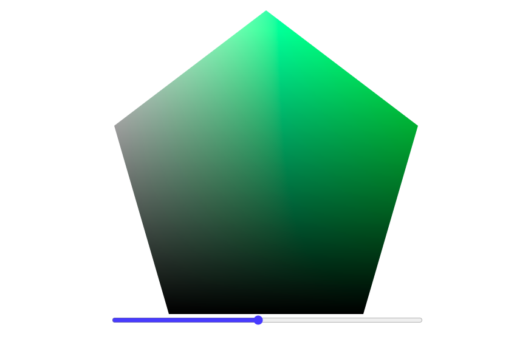

# Color Picker Pentagon

## What To Build



Create a GPU-accelerated color picker with a unique pentagon shape. You'll be implementing the core color computation logic using GPU.js, while we provide the React wrapper and UI components.

1. Core Requirements:
    - Implement a kernel function that generates a color picker gradient
    - Handle hue transitions across the color spectrum
    - Create horizontal gradients from white to the primary color
    - Apply vertical gradients from white to black
2. Color Computation Features:
    - RGB channel calculations based on hue value
    - Smooth transitions between primary colors
    - Proper alpha channel handling
    - Pixel-perfect gradient rendering

## Your Task

Implement the `kernelFunction` in `kernel.js` that:

1. Takes three parameters:
    - `width`: Canvas width
    - `height`: Canvas height
    - `hue`: Current hue value (0-1)
2. Computes appropriate RGB values for each pixel
3. Handles color transitions and gradients
4. Returns the correct channel value based on the thread position

## Getting Started

Clone the repository:
```bash
git clone <link>
cd fringecore-frontend-challenge-colorpicker-pentagon
npm install
npm run dev
```

## Evaluation Points

1. ⭐ Basic color computation
2. ⭐ Correct hue transitions
3. ⭐ Proper gradient implementation
4. ⭐ Performance optimization
5. ⚡ Bonus features:
    - Smooth color interpolation
    - Custom gradient patterns
    - Performance optimizations

## Best Practices

1. Keep computations efficient (GPU-friendly)
2. Use normalized values (0-1) for calculations
3. Handle edge cases properly
4. Maintain clean, well-organized code