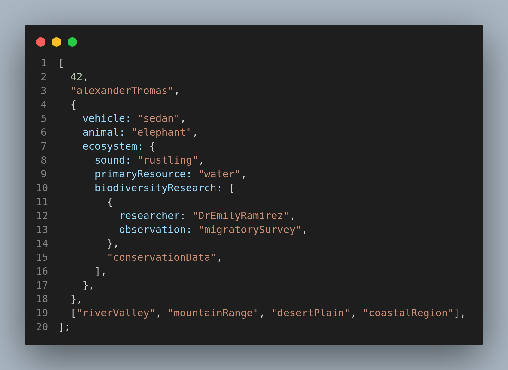
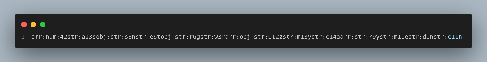

# custom-serializer

Sample input:



Sample output:




## Environment

1. You definitely need NodeJS version `20` such that you can run `.mjs` files directly.

## What To Build

1. We have to build a custom serializer for weird data. We call it weird cause it can be an array, object, string or number.
2. We have to serialize it and make a string out of it. The rules are as follows: 
    - **Number Serialization**
        - Prefix number values with "num:"
    - **String Serialization**
        - Prefix string values with "str:"
        - Apply a special transformation for strings having > 2 characters
        - Transformation: First character + (length - 2) + Last character
    - **Array Serialization**
        - Prefix array values with "arr:"
        - Serialize each array element
        - Concatenate serialized elements without separators
    - **Object Serialization**
        - Prefix object values with "obj:"
        - Serialize only object **values** by their keys
        - Concatenate serialized values without separators
        - Ignore key names in final output
    - **Error Handling**
        - Prefix object values with "err:"
        - value will be “unknown”.
        - Example:
            - Return "err:unknown" for unrecognized data types

## Details

1. Don’t use any external libraries.

## Let’s Start

```bash
git clone <link>
cd custom-serializer
code .
node ./challenge.mjs
```

## Partial

Just know that we fully understand that these challenges are actually pretty tough. Hence it is surely not an all-or-nothing evalution scheme. If you hit any of the features below you’re doing great. Every time you achieve one of these points, pat yourself on the back.

1. You have started the challenge.
2. Your custom serializer is working only for premitive data types (i.e. `string` or `number` ).
3. Your custom serializer is partially complete.

